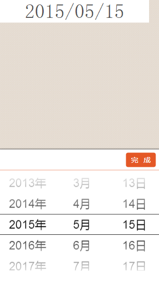

<h1>dateSelector</h1>
============

<h3>这是一个移动设置日期选择组件，组件基于Underscore</h3>
<h4>作者：施天助</h4>

<pre>
	
	define(['zepto', 'underscore', 'datefield'], function($, _, DateField){

    var startDate = $('#startDate');

    require(['underscore.date'], function() {
        var dates = new Date();
        var startDateCom = new DateField(startDate, _(dates).date(), false, function() {
            var date 	= this.date, //
                year 		= date.getFullYear(), //
                month 		= date.getMonth() + 1,
                day         = date.getDate();
            var str = showDateTxt(this, year, month, day);

        });
    });

    function showDateTxt(dateCom, year, month, day){
        if(year && month) {
            month = ~~month;
            month = (month < 10) ? '0' + month : month;
            day = (day < 10) ? '0' + day : day;
            var str = year + '/' + month + '/' + day;
            dateCom.changeShow(str);
            return str;
        } else {
            dateCom.changeShow('请选择');
            return null;
        }
    }

});

</pre>

    

